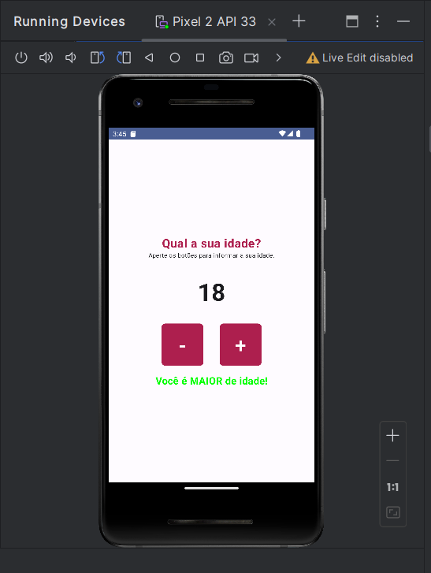

<html>
<head>  </head>

<body>
  

    <h3 align="center"> 
      
      Teste Android Studio - "Minha Idade"
      
    </h3>
    
##

 <h5>MainActivity (Classe): </h5>
  Essa é a classe principal da atividade do Android.
  Ela estende ComponentActivity e é responsável por configurar a interface do usuário.
  
  <h5>onCreate (Função):</h5>
  Método chamado quando a atividade é iniciada.
  Configura o tema do aplicativo usando MinhaIdadeTheme e define o conteúdo da atividade para a função CounterScreen.
    
   <h5>CounterScreen (Composable Function):</h5>
   Função responsável pela criação da interface da tela principal.
   Usa o Compose para construir a interface do usuário.
    
   <h5>Variável idade:</h5>
   É uma variável que mantém o estado da idade do usuário.
   Usando o remember para garantir que o estado seja mantido mesmo quando a interface do usuário for reconstruída.
    
   <h5>Função isIdadeValida:</h5>
   Função que verifica se a idade fornecida está no intervalo desejado (de 0 a 130).
    
   <h5>Interface do Usuário (Compose):</h5>
   Um Column (coluna) que organiza os elementos verticalmente no centro da tela.
   Contém dois botões (Button) para incrementar e decrementar a idade.
   Um bloco de texto (Text) exibindo a idade atual.
   Outro bloco de texto exibindo se o usuário é maior ou menor de idade, dependendo do valor da idade.
   Usa cores e estilos do Material Design.
   
   <h5>CounterScreenPreview (Composable Function):</h5>
   Função de pré-visualização usada durante o desenvolvimento para visualizar a tela CounterScreen com o tema MinhaIdadeTheme.
   O aplicativo, em resumo, oferece uma interface simples para o usuário interagir e informar sua idade, com feedback sobre se é maior ou menor de idade.
   Isso serve como um exemplo introdutório do uso do Compose no desenvolvimento de interfaces Android.
    
  

##
    

 

</body>
</html>
